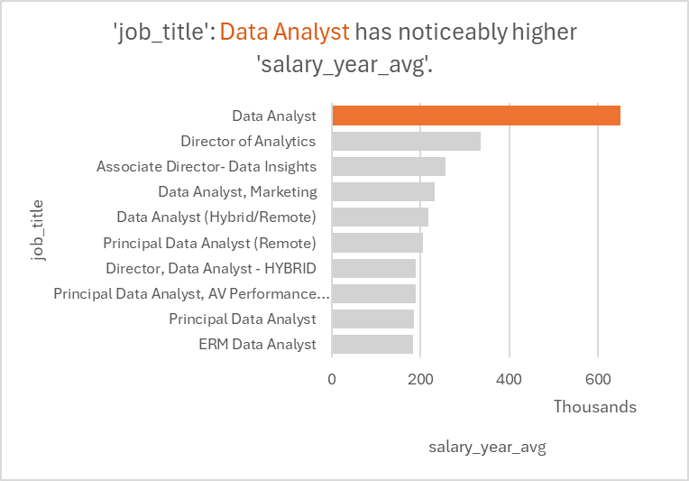
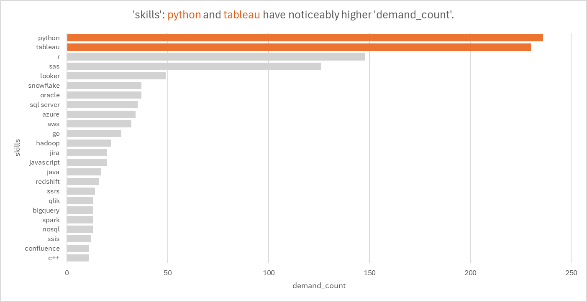
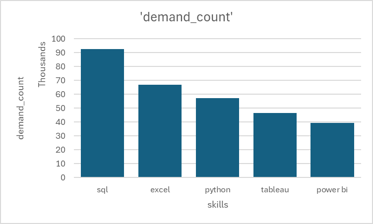
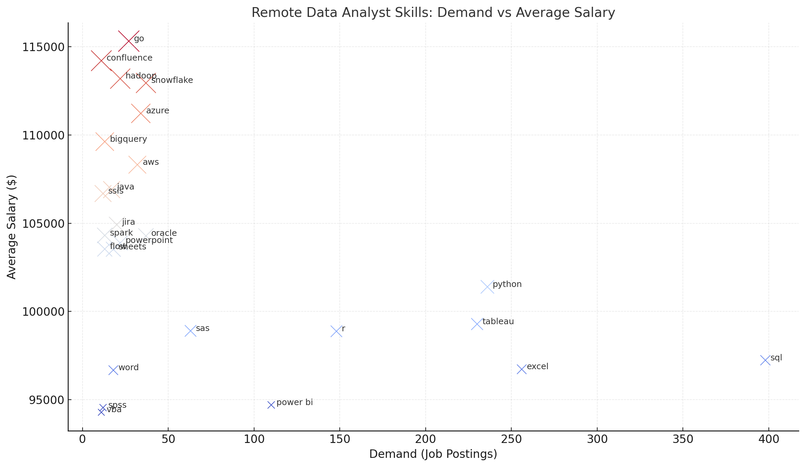

# Introduction
My first capstone project diving into the data job market using databases from 2023! Focusing on data analyst roles (my interested field), this project explores top-paying jobs, in-demand skills, and where high demand meets high salary in data analytics. Database and project details provided by Luke Barousse.

    Check out SQL queries here: [project_sql folder](/project_sql/)
# Background
Utilized as a way to learn more about data analyst jobs and the skills required to become a data analyst. The purpose of the analysis was to find out the top-paid and most in-demand skills in data and streamlining it all to find optimal jobs.

Data source comes from [SQL_Course](https://lukebarousse.com/sql).

### The questions I asked for my SQL queries were:

1. What are the top-paying jobs for my role?

2. What are the skills required for these top-paying roles?

3. What are the most in-demand skills for my role?

4. What are the top skills based on salary for my role?

5. What are the most optimal skills to learn?

# Tools I used
For my deep dive into the data analyst job market, I used a few powerful tools:

- **SQL:** The backbone and major tool I primarily used, allowing me to query databases.
- **PostgreSQL:** My chosen database management system,based on data of how popular it is.
- **Visual Studio Code(VS Code):** My main tool for database management and executing the SQL queries.
- **Microsoft Excel:** I used this to paste the results of my queries and show data visualization graphs inside of excel to show the full range of my data analytics skills.
- **Git & GitHub:** Used to pull and share all of my SQL work and analysis, ensuring collaboration and project tracking.

# The Analysis
Each query for this project aimed to investigate specific aspects of the data job market, specifically for me, data analysts. Here's how I approached each question:

### 1. Top Paying Data Analyst Jobs
To identify the highest-paying roles, I filtered data analyst positions by average yearly salary and location, focusing on remote jobs and my local area. This query highlights the high paying opportunities in this field. Visualization and additional pivot tables created on Excel including Salt Lake City and Los Angeles areas.


```sql
SELECT
    job_id,
    job_title,
    job_location,
    job_schedule_type,
    salary_year_avg,
    job_posted_date,
    name AS company_name
FROM
    job_postings_fact
LEFT JOIN company_dim ON job_postings_fact.company_id = company_dim.company_id
WHERE
    job_title_short = 'Data Analyst' AND
    job_location = 'Anywhere' AND
    salary_year_avg IS NOT NULL
ORDER BY
    salary_year_avg DESC
LIMIT 10
```

### 2. Top Paying Job Skills
To identify the top skills required for the roles I found in the first query. I added to the previous query by including a CTE and cleaned the data to better show skills over job titles. Visualization and additional data also provided from excel analysis.

```sql
WITH top_paying_jobs AS (
    SELECT
        job_id,
        job_title,
        salary_year_avg,
        name AS company_name
    FROM
        job_postings_fact
    LEFT JOIN company_dim ON job_postings_fact.company_id = company_dim.company_id
    WHERE
        job_title_short = 'Data Analyst' AND
        job_location = 'Anywhere' AND
        salary_year_avg IS NOT NULL
    ORDER BY
        salary_year_avg DESC
    LIMIT 10
)

SELECT
    top_paying_jobs.*,
    skills
FROM top_paying_jobs
INNER JOIN skills_job_dim ON top_paying_jobs.job_id = skills_job_dim.job_id
INNER JOIN skills_dim ON skills_job_dim.skill_id = skills_dim.skill_id
```


### 3. Top Demanded Skills
To identify the top 5 in-demand skills used for a data analyst by retooling the previous query but focusing on all job postings instead of remote. I inner joined skills and job postings tables and limited it to 5 skills.

```sql
SELECT
    skills,
    COUNT(skills_job_dim.job_id) AS demand_count
FROM job_postings_fact
INNER JOIN skills_job_dim ON job_postings_fact.job_id = skills_job_dim.job_id
INNER JOIN skills_dim ON skills_job_dim.skill_id = skills_dim.skill_id
WHERE
    job_title_short = 'Data Analyst' AND
    job_work_from_home = True
GROUP BY
    skills
ORDER BY
    demand_count DESC
LIMIT 5;
```



### 4. Top Payinig Skills
To identify high paying skills for data analyst position and look at the average by joining skills table and salary year average table. Showing the top 25 results.

```sql
SELECT
    skills,
    ROUND(AVG(salary_year_avg), 0) AS avg_salary
FROM job_postings_fact
INNER JOIN skills_job_dim ON job_postings_fact.job_id = skills_job_dim.job_id
INNER JOIN skills_dim ON skills_job_dim.skill_id = skills_dim.skill_id
WHERE
    job_title_short = 'Data Analyst'
    AND salary_year_avg IS NOT NULL
    AND job_work_from_home = True
GROUP BY
    skills
ORDER BY
    avg_salary DESC
LIMIT 25;
```

| **Skill**     | **Avg Salary ($)** |
| ------------- | ------------------- |
| pyspark       | 208,172             |
| bitbucket     | 189,155             |
| couchbase     | 160,515             |
| watson        | 160,515             |
| datarobot     | 155,485             |
| gitlab        | 154,500             |
| swift         | 153,750             |
| jupyter       | 152,777             |
| pandas        | 151,821             |
| elasticsearch | 145,000             |
| numpy         | 143,513             |
| scala         | 141,907             |
| go            | 139,292             |
| confluence    | 138,750             |
| gcp           | 138,500             |
| azure         | 137,950             |
| airflow       | 137,000             |
| python        | 136,708             |
| r             | 134,345             |
| tableau       | 133,520             |
| snowflake     | 132,750             |
| spark         | 131,250             |
| aws           | 130,725             |
| power bi      | 128,425             |
| sql           | 125,500             |


### 5. Most Optimal Skills
By adding the queries from query #3 and query #5, I combined these two queries to identify the most optimal skills to learn for a data analyst position, limiting it to top 25 skills and provided a visualization to better show the level of demand for each skill matched with average salary.

```sql
WITH skills_demand AS (
    SELECT
        skills_dim.skill_id,
        skills_dim.skills,
        COUNT(skills_job_dim.job_id) AS demand_count
    FROM job_postings_fact
    INNER JOIN skills_job_dim ON job_postings_fact.job_id = skills_job_dim.job_id
    INNER JOIN skills_dim ON skills_job_dim.skill_id = skills_dim.skill_id
    WHERE
        job_title_short = 'Data Analyst'
        AND salary_year_avg IS NOT NULL
        AND job_work_from_home = True
    GROUP BY
        skills_dim.skill_id,
        skills_dim.skills
)
, average_salary AS (
    SELECT
        skills_job_dim.skill_id,
        ROUND(AVG(salary_year_avg), 0) AS avg_salary
    FROM job_postings_fact
    INNER JOIN skills_job_dim ON job_postings_fact.job_id = skills_job_dim.job_id
    INNER JOIN skills_dim ON skills_job_dim.skill_id = skills_dim.skill_id
    WHERE
        job_title_short = 'Data Analyst'
        AND salary_year_avg IS NOT NULL
        AND job_work_from_home = True
    GROUP BY
        skills_job_dim.skill_id
)

SELECT
    skills_demand.skill_id,
    skills_demand.skills,
    demand_count,
    avg_salary
FROM
    skills_demand
INNER JOIN average_salary ON skills_demand.skill_id = average_salary.skill_id
WHERE
    demand_count>10
ORDER BY
    avg_salary DESC,
    demand_count DESC
LIMIT 25
```


# What I Learned
Throughout this project I've learned how to better apply SQL while using many tools:

- **Complex Query crafting with VScode:** I was able to use advanced SQL queries with VSCode and Postgres to show what I've learned and apply them to real datasets.
- **Data Aggregation And Table Joins:** I got comfortable with GROUP BY and turned aggregate functions like COUNT and AVG into useful data-summarizing tools and used a lot of CTE table joining.
- **Used The Whole Analysis Process:** I was able to show my work using all of the top tools mentioned in my research and show off my knowledge of visualizations and pivot tables inside of Excel while writing formulas and queries in SQL.

# Conclusion

This project helped me learn many new tools and apply them in real life. I got to learn and enhance my skills inside SQL while also learning new tools such as VScode and Github. The overall purpose was to not only teach me SQL but also to learn more about the job of a data analyst and the skills necessary to become one. By focusing on high-demand, high-salary skills, I can better position myself in this competitive market for more success as a data analyst with the knowledge I have gathered.